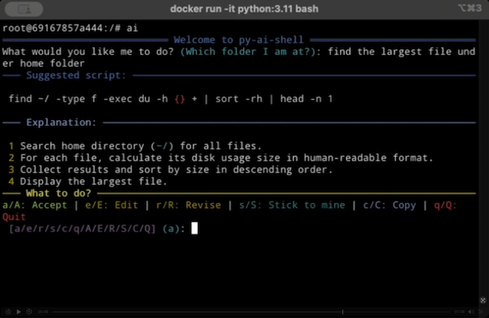

# py-ai-shell

[](https://github.com/cheney-yan/py-ai-shell/actions/workflows/python-package.yml)
[](https://badge.fury.io/py/py-ai-shell)
[](https://opensource.org/licenses/MIT)

AI-powered shell, helping you create correct command format and explain for all the errors. It's designed for *terminal enthusiasts*!

py-ai-shell transforms your natural language descriptions into shell commands, explains what they do, and helps you fix errors. It's like having a shell expert by your side, making command-line work more accessible and efficient, and quickly learn form a master.

<a href="http://www.youtube.com/watch?feature=player_embedded&v=nvY617ptHIs
" target="_blank"></a>

## Installation

```bash
pip install py-ai-shell

# need to set up for the first time. Minimum need to set up OPENAI_KEY
ai config set OPENAI_KEY=your_api_key
```


**System Requirements:**
- Python 3.8 or higher
- OpenAI API key (Or any compatible LLM models)

py-ai-shell works on Linux, macOS, and Windows with support for bash, zsh, fish, and PowerShell.

### Usage

```bash
# Start py-ai-shell interactive mode
ai

# Run with a initial request
ai "list all files in the current directory"

```

When you run a command, py-ai-shell will:
1. Generate the appropriate shell command
2. Show you what it's going to do
3. Execute the command when you approve
4. Provide explanations and error analysis if needed

## Features

- **Natural Language Command Generation**: Convert plain English to shell commands
- **Command Explanations**: Understand what commands do before running them
- **Error Analysis**: Get explanations and suggestions when commands fail
- **Interactive Mode**: Full interactive shell experience
- **Configurable**: Use models you specify
- **Copy to Clipboard**: Easily copy generated commands

## Configuration

py-ai-shell can be configured using the `config` command:

```bash
# Set your OpenAI API key
ai config set OPENAI_KEY=your_api_key

# Set the model to use (default: gpt-4.1-nano)
ai config set MODEL=gpt-4.1-nano

# Set API endpoint (useful for proxies or alternative providers)
ai config set OPENAI_API_ENDPOINT=https://api.openai.com/v1

```

Configuration is stored in `~/.config/py-ai-shell/config.ini` and can be edited directly.

## Advanced Usage

### Error Analysis

When a command fails, py-ai-shell can analyze the error and suggest fixes:

```bash
$ ai "find files modified in the last 24 hours"
# If the command fails, py-ai-shell will offer to analyze the error
Command failed. Would you like an explanation? (?/??/???)
```

Enter `?` for a brief explanation, `??` for a standard explanation, or `???` for a detailed analysis.

### Command History

py-ai-shell maintains a history of your recent commands and their results, providing context for future commands. This helps the AI understand your environment and previous actions. You can refer the history using terms like "previous results, previous commands", etc.

### Interactive Options

After a command is proposed, you have options to:
- `a/A`: Accept and run the command
- `e/E`: Edit the command before running
- `r/R`: Revise (ask AI to generate a new command)
- `c/C`: Copy the command to clipboard only
- `s/S`: Stick to your original command
- `q/Q`: Quit/cancel

## Known Issues
- It does not work well with interactive terminal applications that require a TTY, such as the vi editor. Screen display could be complicated.
- Control-C might not be able to terminate existing command execution.


## Future Plans
 - Support MCP, especially document lookup, internet searching, and file operations
 - Using agent for more complex tasks, like dangerous command protection, error alerts, etc.
 - Enhance once-off mode functionality


## Development

### Setting Up Development Environment

1. Clone the repository:
   ```bash
   git clone https://github.com/cheney-yan/py-ai-shell.git
   cd py-ai-shell
   ```

1. Install development dependencies:
   ```bash
   make dev
   ```
1. Run locally (with hot loading):
   ```bash
   ./local_run.py
   ```

### Available Make Commands

- `make help`: Show available commands
- `make clean`: Remove all build, test, coverage and Python artifacts
- `make dist`: Package for distribution
- `make dev`: Install development dependencies
- `make version`: Create new package version
- `make publish`: Publish to PyPI
- `make git_tag`: Create github tag by package version

## Contributing

Contributions are welcome! 

## License

This project is licensed under the MIT License - see the [LICENSE](LICENSE) file for details.

## Credits

- This project is inspired by [AI Shell](https://github.com/BuilderIO/ai-shell)
- Built with [OpenAI API](https://openai.com/api/)
- Command-line interface powered by [Click](https://click.palletsprojects.com/)
- Terminal styling with [Rich](https://rich.readthedocs.io/)
